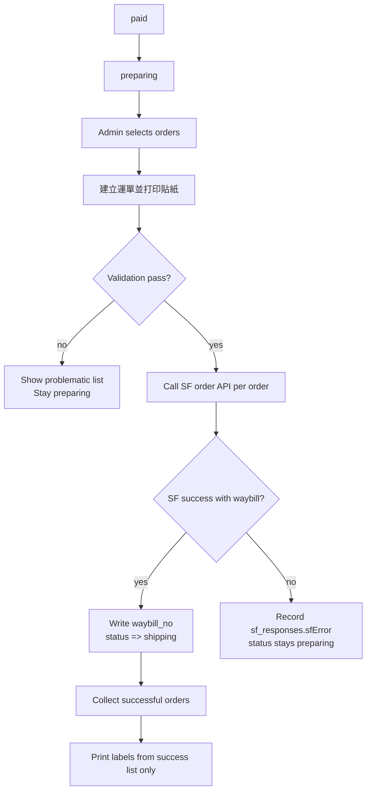

# SF Fulfillment Batch Flow

This project now uses a professional batch flow to keep SF booking and label printing consistent.

## Goal

- Manual control: admin decides when to book SF.
- One source of truth: labels are printed from successful SF bookings only.
- No false shipping status: failed SF booking stays in `preparing`.

## Operator SOP

1. Go to admin `訂單管理` and switch to `備貨中 (preparing)`.
2. Select the orders you want to dispatch today.
3. Click `建立運單並打印貼紙`.
4. System validates each order:
   - Delivery method must be `sf_delivery` or `sf_locker`.
   - Receiver name and phone must exist.
   - Home delivery requires district + address + floor + flat.
   - Locker delivery requires locker code.
   - Orders with existing `waybill_no` are blocked from re-booking.
5. Confirm the validation modal to continue.
6. System books SF for valid orders:
   - Success: set `waybill_no`, set status to `shipping`.
   - Failure: keep status `preparing`, record error in `sf_responses`.
7. System auto-prints labels for successful bookings only.
8. Reprint only when needed via `重印順豐貼紙`.

## State Machine

## Why this avoids count mismatch

- Booking and printing are in the same batch operation.
- Printed label count is derived from successful booking results, not manual counting.
- Failed bookings are explicitly separated and cannot silently move to shipping.

## Troubleshooting

- Popup blocked: allow browser popups for label print window.
- Many failures: check SF credentials and sender config.
- Partial success: retry failed orders after fixing address/phone issues.
